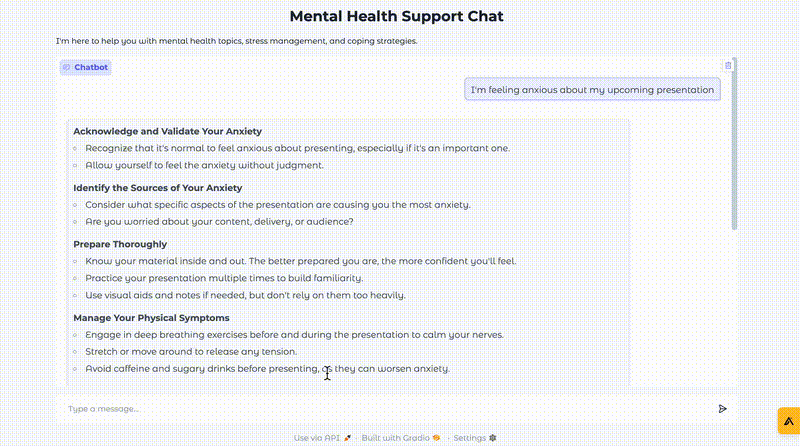

# Mental Health Chatbot

## Overview
This is a conversational AI chatbot designed to provide mental health support, stress management techniques, and coping strategies. Built using Gradio and Google Gemini AI, it ensures a safe and moderated experience with content filtering for sensitive topics.

## Features
- **AI-Powered Responses**: Uses Google Gemini AI for intelligent and empathetic responses.
- **Content Moderation**: Blocks harmful phrases and ensures discussion stays on mental health topics.
- **Emergency Resources**: Provides crisis hotline numbers when necessary.
- **Logging**: Captures interactions for debugging and improvement.
- **User-Friendly Interface**: Powered by Gradio for easy interaction.

## Tech Stack
- **Python**
- **Google Generative AI (Gemini-Pro)**
- **Gradio**
- **YAML for Config Management**
- **Logging for Debugging**

## Setup Instructions
### Prerequisites
- Python 3.8+
- A Google API Key (for Gemini AI)
- Virtual environment (recommended)

### Installation
1. Clone the repository:
   ```sh
   git clone https://github.com/YOUR_GITHUB_USERNAME/mental-health-chatbot.git
   cd mental-health-chatbot
   ```
2. Create a virtual environment and activate it:
   ```sh
   python -m venv venv
   source venv/bin/activate  # Mac/Linux
   venv\Scripts\activate  # Windows
   ```
3. Install dependencies:
   ```sh
   pip install -r requirements.txt
   ```
4. Set up environment variables:
   - Create a `.env` file and add your Google API key:
     ```sh
     GOOGLE_API_KEY=your_google_api_key_here
     ```

## Running the Chatbot



To launch the chatbot, run:
```sh
python app.py
```
This will start the Gradio interface and provide a shareable link.

## Configuration
The chatbot uses `config.yaml` for safety settings and keyword filtering. Update it as needed.

```yaml
safety:
  blocked_terms:
    - "kill myself"
    - "end my life"
    - "suicide methods"
    - "ways to die"
  topic_keywords:
    - "anxiety"
    - "depression"
    - "stress"
    - "mindfulness"
  max_response_length: 500
  emergency_resources:
    crisis_line: "988 Suicide and Crisis Lifeline"
    emergency: "911"
    online_resources: "https://www.samhsa.gov/find-help/national-helpline"
```

## Example Prompts
- *"I'm feeling anxious about my upcoming presentation."*
- *"Can you suggest some mindfulness exercises?"*
- *"How can I manage stress better?"*
- *"I'm having trouble sleeping lately."*

## Potential Enhancements
- **Multi-Turn Context Retention**: Improve memory for long conversations.
- **Voice Support**: Enable speech-to-text input.
- **Integration with More Mental Health Resources**.

## License
MIT License

## Author
Ogunniran Oluwasijibomi - https://github.com/OGsiji/ https://www.linkedin.com/in/ogunniransijibomi/

---
This chatbot is not a substitute for professional help. If you're in crisis, please contact emergency services.

